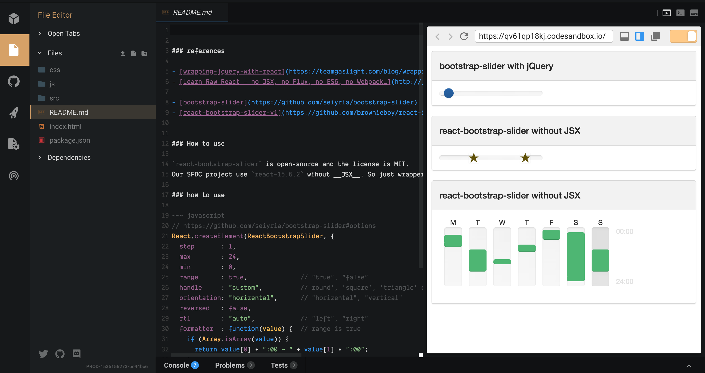

https://codesandbox.io/s/qv61qp18kj
### references

- [wrapping-jquery-with-react](https://teamgaslight.com/blog/wrapping-jquery-with-react)
- [Learn Raw React — no JSX, no Flux, no ES6, no Webpack…](http://jamesknelson.com/learn-raw-react-no-jsx-flux-es6-webpack/)

- [bootstrap-slider](https://github.com/seiyria/bootstrap-slider)
- [react-bootstrap-slider-v1](https://github.com/brownieboy/react-bootstrap-slider/tree/v1.0.6)

### How to use

`react-bootstrap-slider` is open-source and the license is MIT. 
Our SFDC project use `react-15.6.2` wihout __JSX__. So just wrapper `react-bootstrap-slider` that can run in this case.

### how to use

~~~ javascript 
// https://github.com/seiyria/bootstrap-slider#options
React.createElement(ReactBootstrapSlider, {
  step       : 1,
  max        : 24,
  min        : 0,
  range      : true,              // "true", "false"
  handle     : "custom",          // round', 'square', 'triangle' or 'custom'
  orientation: "horizental",      // "horizental", "vertical"
  reversed   : false,
  rtl        : "auto",            // "left", "right"
  formatter  : function(value) {  // range is true
    if (Array.isArray(value)) { 
      return value[0] + ":00 ~ " + value[1] + ":00";
    }
    return value;
  },
  handleChange: function(data) {
    console.log(data.target.value);
  },
  value   : [8, 20],    // eg: range? [1, 3]: 3
  disabled: "anything"  // "disabled", "anything"
});

~~~